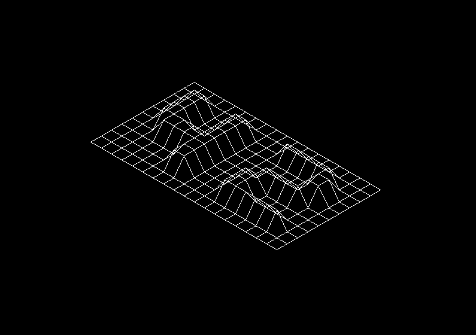
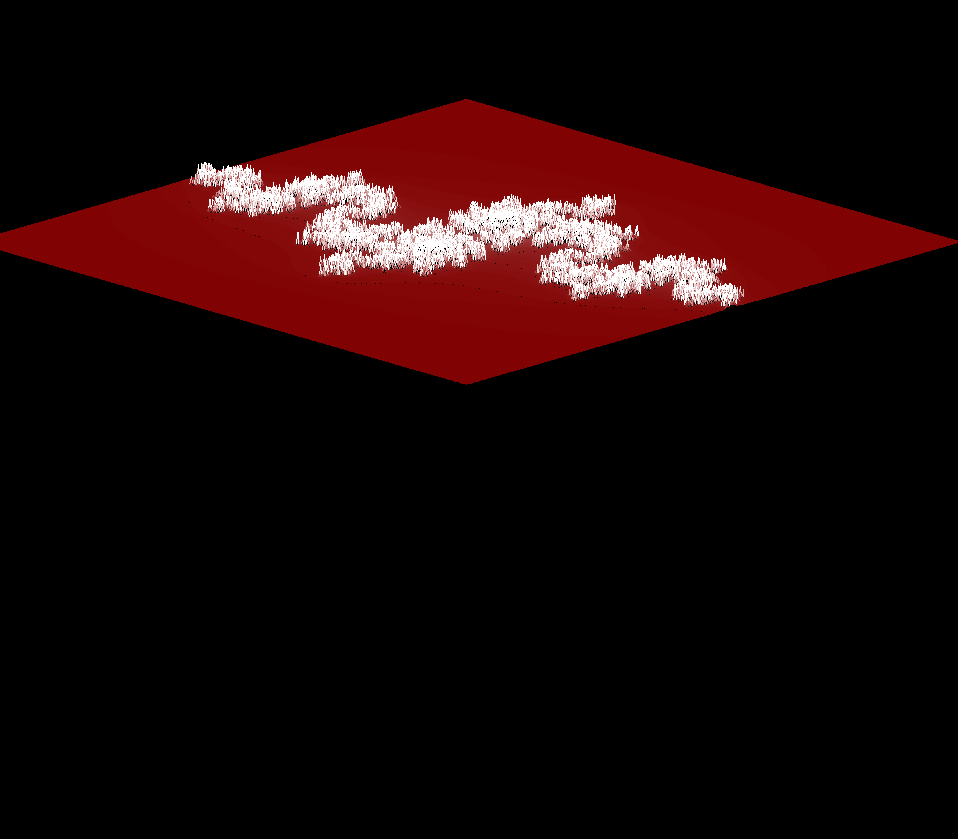
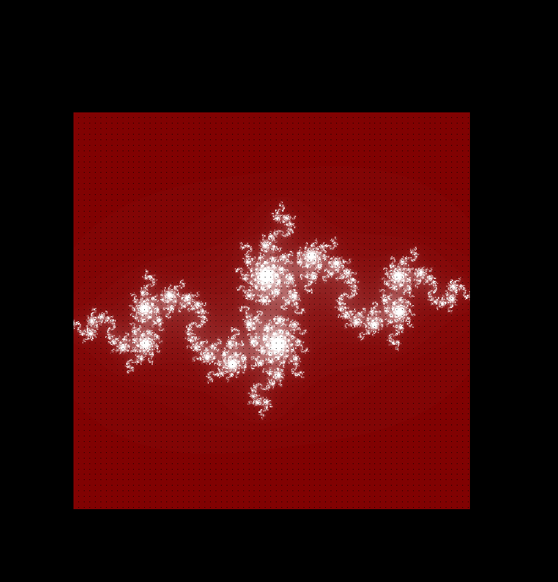

# *This project has been created as part of the 42 curriculum by mchanlia*

# **Program Name** : ['WireFrameModel_FDF']





### **Short Description** : 
> This project introduces the fundamentals of 3D computer graphics, matrix transformations, and line rendering in C by rendering a 3D wireframe (Fil de Fer) model of a landscape from a topographical map.  

### **Table of Content**:

|  ---  |                Section                 |         ---         |
| :---: | :------------------------------------: | :-----------------: |
|  1.   |      [Description](#description)       | :large_blue_circle: |
|  1.1  |     [Program Name](#program-name)     |   :yellow_circle:   |
|  1.2  |  [Project Summary](#project-summary-)  |   :yellow_circle:   |
|  1.3  | [Project Features](#project-features-) |   :yellow_circle:   |
|  2.   |     [Instructions](#instructions)      | :large_blue_circle: |
|  2.1  |     [Installation](#installation-)     |   :yellow_circle:   |
|  2.2  |            [Usage](#usage-)            |   :yellow_circle:   |
|  3.   |        [Resources](#resources)         | :large_blue_circle: |
  

# Description

## **Program Name**:
### WireFrameModel_FDF

Introduction :

FdF (short for Fil de Fer, which translates to wireframe model) is the first graphical project in the 42 curriculum. It acts as an introduction to basic computer graphics, window management, event handling, and applied mathematics for geometric programming.

At its core, drawing on a screen means calculating and placing pixels. Since modern operating systems handle window management, we use the 42 graphical library MiniLibX to open a window and push pixels to it. To draw a full 3D representation from scratch, you have to bridge the gap between abstract coordinate data and actual visual lines using mathematical algorithms.

You will interact with fundamental computer graphic concepts such as:  
- Isometric Projection
- Matrices
- Bresenham's Line Algorithm

Apart from the use of MiniLibX to push images to the screen, this project revolves around parsing a topographical map of heights (.fdf files) into a 2D array, computing the 3D space transformations (scaling, translating, rotating), and ultimately projecting it onto a 2D screen using an isometric perspective.

Apart from the use of socket(), in order to make our network a bit more realistic we had to make the transmission phase (read and write part), be non-blocking, hence making the server capable of handling multiples users simultaneously. We chose poll() for that mission for its simplicity and shared similarity with epoll.

- The aim of the project is to go over:

[How to build a 3D graphic renderer natively in C:]  

- File parsing to retrieve raw (x, y, z).
- Coordinates and color data.Matrix math for 3D transformations (translation, scaling, and rotation on different axes).
- The implementation of Bresenham's line drawing algorithm to link points efficiently on a 2D grid.
- Managing window events (hooks) natively using the MiniLibX library (e.g., closing the window, capturing keystrokes for movement).

This project emphasizes the understanding of:
- Graphical computation and handling coordinates in Euclidean space.
- The foundations of modern 3D rendering pipelines and geometric mathematics.

### **Project Summary** :
The program takes an .fdf file as an argument, which contains a grid of numbers where each number represents a point's altitude ($z$-axis). It parses this data and renders the landscape as a 3D wireframe mesh in an isometric view. Using customized scaling and rotation formulas, it accurately links these vertices together smoothly within an interactive graphical window.  


### **Project Features** :

- Parsing and validating .fdf grid files into usable struct arrays.
- High-performance pixel pushing via an image buffer for smooth frame rendering.
- Isometric mathematical projection.
- Line drawing implemented completely from scratch using Bresenham's algorithm.
- Interactive view controls (closing window safely, shifting map).  

# Instructions

### **Installation** :
> ```  
> git clone <repo_url>  
> cd WireFrameModel_FDF  
> make  
> ```

### **Usage** :
> ```  
> Launch the program by passing a map file as an argument
> ./fdf test_maps/42.fdf
> Alternatively, try other parsed maps
> ./fdf test_maps/mars.fdf
>```

# Resources

#### Docs

[Website : MiniLibx tutorial](https://harm-smits.github.io/42docs/libs/minilibx)  
[Website : Isometric Projection](https://en.wikipedia.org/wiki/Isometric_projection)  
[Website : 3D rotation matrix](https://en.wikipedia.org/wiki/Rotation_matrix#In_three_dimensions)  
[Website : Bresengam's Line Algorithm](https://en.wikipedia.org/wiki/Bresenham%27s_line_algorithm)  
